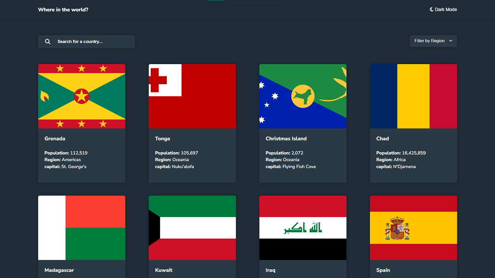

# Frontend Mentor - REST Countries API with color theme switcher solution

This is a solution to the [REST Countries API with color theme switcher challenge on Frontend Mentor](https://www.frontendmentor.io/challenges/rest-countries-api-with-color-theme-switcher-5cacc469fec04111f7b848ca). Frontend Mentor challenges help you improve your coding skills by building realistic projects. 

## Table of contents

- [Overview](#overview)
  - [The challenge](#the-challenge)
  - [Screenshot](#screenshot)
  - [Links](#links)
- [My process](#my-process)
  - [Built with](#built-with)
  - [What I learned](#what-i-learned)
- [Author](#author)

## Overview

### The challenge

Users should be able to:

- See all countries from the API on the homepage
- Search for a country using an `input` field
- Filter countries by region
- Click on a country to see more detailed information on a separate page
- Click through to the border countries on the detail page
- Toggle the color scheme between light and dark mode
- Modes are now dynamic. If changed in one place, then they are changed everywhere

### Screenshot

### Links

- [see solution](https://github.com/S-Alif/rest-countries-api-with-color-theme-switcher-master)
- [see live demo](https://frm-challenges.netlify.app/challenges/rest-countries-api-with-color-theme-switcher-master/)

### Built with

- Semantic HTML5 markup
- CSS custom properties
- Flexbox
- Basic JavaScript

**Note: These are just examples. Delete this note and replace the list above with your own choices**

### What I learned

Before this project, I struggled a lot with CSS Flexbox. Even though I knew how they worked, I used to mess up. But this project changed all of that

## Author

- Frontend Mentor - [@S-Alif](https://www.frontendmentor.io/profile/S-Alif)
- Twitter - [@sagor_alif8920](https://twitter.com/sagor_alif8920)